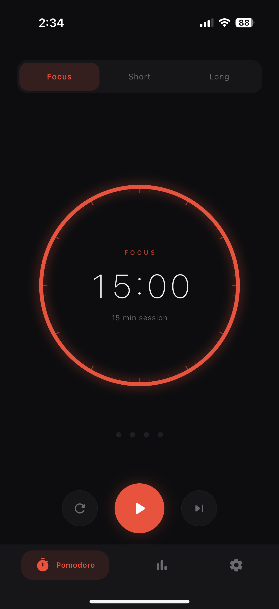
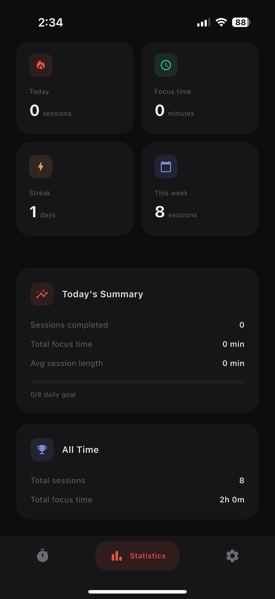
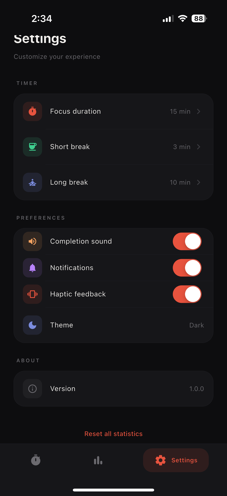
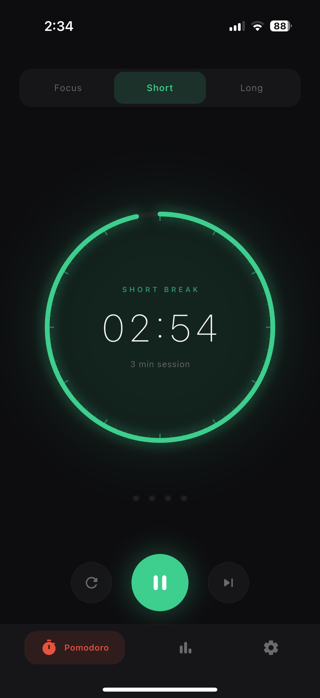

# Pomodoro Timer

A beautiful and functional Pomodoro timer application built with Flutter, featuring lock-screen timer display on both Android and iOS platforms.

## 📱 Screenshots

<p align="center">
  
  
  
  
  
</p>

## ✨ Features

- **🍅 Pomodoro Timer** - Classic 25-minute work sessions with 5-minute breaks
- **🔄 Multiple Modes** - Work, Short Break, and Long Break modes
- **🔒 Lock-Screen Display** - See your timer even when your phone is locked
  - **Android**: Foreground service notification with live countdown
  - **iOS**: Live Activities with Dynamic Island support (iOS 16.2+)
- **⏸️ Full Control** - Start, pause, resume, and reset your timer
- **📱 Cross-Platform** - Works seamlessly on both Android and iOS
- **🎨 Beautiful UI** - Clean, modern interface with smooth animations
- **🔋 Battery Efficient** - Optimized for minimal battery consumption

## 🚀 Getting Started

```bash
flutter pub get
flutter run
```

## Android Lock-Screen Notification (Foreground Service)

The app shows an **ongoing notification** with a live countdown while the timer
is running. The notification is visible on the lock screen and in the
notification shade, and keeps updating even when the app is in the background.

### How it works

| User action       | What happens in the notification                        |
|-------------------|---------------------------------------------------------|
| **Start**         | Ongoing notification appears: `Time left: mm:ss`        |
| **Pause** (UI/notification button) | Text changes to `Paused — mm:ss left`    |
| **Resume**        | Countdown resumes                                       |
| **Stop / Reset**  | Notification is removed                                 |
| **Timer finishes**| Shows `Timer finished!` for 5 s, then auto-removes      |

The notification also has **Pause / Resume** and **Stop** action buttons so
the user can control the timer without opening the app.

### Notification permission (Android 13+)

On Android 13 (API 33) and above, the app must request the
`POST_NOTIFICATIONS` runtime permission. The app does this automatically
the first time the user starts a timer.

If the user denies the permission, the timer still works normally — only the
notification will not appear.

To **manually grant/revoke** the permission:

1. Long-press the app icon → **App Info**
2. Tap **Notifications**
3. Toggle the switch

### Testing checklist

1. **Start** the timer → lock the screen → verify the notification is visible
   on the lock screen with the countdown updating every ~2 seconds.
2. Press **Home** → open the notification shade → verify the countdown is
   still ticking.
3. Tap **Pause** in the notification → verify the text changes to
   `Paused — mm:ss left` and the countdown stops.
4. Tap **Resume** in the notification → verify the countdown resumes.
5. Tap **Stop** in the notification → verify the notification disappears.
6. Open the app after any notification-button action → verify the in-app
   UI matches the notification state.
7. Let the timer run to zero → verify `Timer finished!` appears for ~5 s,
   then the notification is removed.

### Architecture

```
Flutter (Dart)                          Android (Kotlin)
─────────────────                       ───────────────────────────
TimerViewModel                          TimerForegroundService
  │                                       │
  │── toggleTimer() ──┐                   │── startForeground()
  │── reset()         │  MethodChannel    │── Handler tick (2s)
  │── switchMode()    ├─────────────────► │── notify(updatedNotif)
  │── _onTimerComplete│                   │── stopForeground()
  │                   │                   │
  │◄──────────────────┘  (reverse call)   │── notifyFlutter()
  │   _onServiceAction()                  │   (notification buttons)
                                          │
NotificationService                     MainActivity
  (Dart MethodChannel wrapper)            (configures MethodChannel)
```

### Update frequency

The notification refreshes every **2 seconds**. This is a deliberate trade-off:

- **1 s** — most "live" but doubles wake-ups; may be throttled by some OEMs.
- **2 s** — responsive enough; battery-friendly. **(chosen)**
- **5–10 s** — too laggy for a visible countdown.

The displayed time is always calculated from an absolute `endTimeMillis`
timestamp, so even if an update is delayed the value shown is never wrong.

## iOS Lock-Screen Timer (Live Activities)

On iOS 16.2+, the app uses **Live Activities** to display a real-time countdown
on the lock screen and Dynamic Island. Unlike Android's periodic notification
updates, iOS renders the countdown natively using `Text(timerInterval:countsDown:)`
— the system updates the display every second with **zero** push updates or
background work from the app.

### How it works

| User action       | What happens on the lock screen                          |
|-------------------|----------------------------------------------------------|
| **Start**         | Live Activity appears with a live countdown (`mm:ss`)    |
| **Pause**         | Shows `PAUSED` badge + static remaining time in orange   |
| **Resume**        | Live countdown resumes                                   |
| **Stop / Reset**  | Live Activity is dismissed immediately                   |

### Requirements

- **iOS 16.2+** (ActivityKit `ActivityContent` API)
- Live Activities must be enabled: **Settings → [App] → Live Activities → ON**
  (enabled by default on fresh installs)
- No special runtime permission prompt is needed

### Testing checklist (iOS)

1. **Start** the timer → lock the screen → verify the Live Activity shows
   the countdown on the lock screen, updating every second.
2. On iPhone 14 Pro+ / iPhone 15+: verify the **Dynamic Island** shows the
   timer icon and countdown in compact mode.
3. Long-press the Dynamic Island → verify the expanded view shows the mode
   label and countdown.
4. **Pause** from the app → verify the lock screen shows `PAUSED` with a
   static time in orange.
5. **Resume** → verify the countdown resumes.
6. **Stop / Reset** → verify the Live Activity disappears.

### Architecture (iOS)

```
Flutter (Dart)                          iOS (Swift)
─────────────────                       ──────────────────────────────
TimerViewModel                          TimerLiveActivityManager
  │                                       │  (FlutterPlugin)
  │── toggleTimer() ──┐                   │── Activity.request()
  │── reset()         │  MethodChannel    │── activity.update()
  │── switchMode()    ├─────────────────► │── activity.end()
  │── _onTimerComplete│                   │
  │                   │                   │
NotificationService   │                 TimerWidgetExtension (target)
  (shared Dart code)  │                   │── TimerLockScreenView
                      │                   │── DynamicIsland views
                      │                   │── Text(timerInterval:) ← system-rendered
                      │                 TimerAttributes (shared)
                      │                   │── timerName, endTime, isPaused
```

### Key difference from Android

| Aspect              | Android                           | iOS                                |
|---------------------|-----------------------------------|------------------------------------|
| Mechanism           | Foreground Service + Notification  | Live Activity (ActivityKit)        |
| Countdown rendering | App updates notification every 2s  | System renders `Text(timerInterval:)` every 1s |
| Battery impact      | Low (2s Handler wake-ups)          | None (system-rendered)             |
| Action buttons      | Pause / Resume / Stop in notif     | Not available (control via app)    |
| Background survival | Foreground service keeps process   | Not needed — system renders UI     |

## Resources

- [Flutter docs](https://docs.flutter.dev/)
- [Android Foreground Services](https://developer.android.com/develop/background-work/services/foreground-services)
- [iOS Live Activities](https://developer.apple.com/documentation/activitykit/displaying-live-data-with-live-activities)
